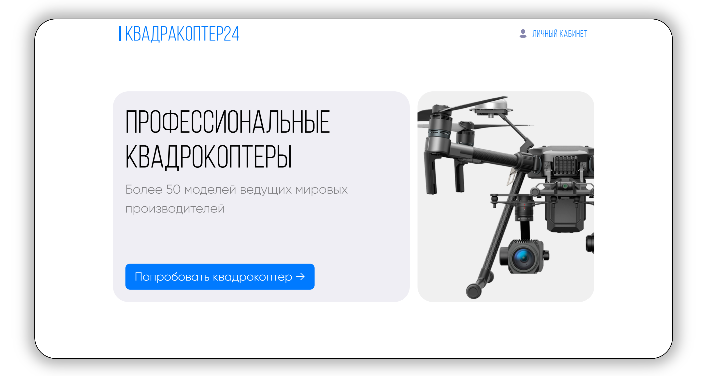

# Quadracopter24



[Engilsh lang](./docs/README.en.md)

## Documentation

- [Description](#description)
- [Start App](#start-app)
- [Tech Stack](#tech-stack)
- [Competitors](#competitors)
- [License](#license)


## Description

Сервис создан в рамках 24-часового хакатона Digital Sky Innovations и предназначен для сбора пользовательских запросов на использование квадрокоптера. Клиент заполняет форму, в которой описывает, для каких целей ему нужен дрон. На основе введённого текста нейросеть классифицирует тип подходящего квадрокоптера и автоматически формирует заявку для аналитиков. Аналитики, получив предварительно классифицированную информацию, подбирают соответствующую модель и организуют отправку дрона клиенту.

## Start App

Что бы запустить приложение нужно иметь виртальное окружение Node.js и так же скачать и запустить Docker. После этого повторить этапы описанные снизу в листинге 

```bash
1. git clone https://github.com/DKMFzF/fkv_test.git

2. Запускаем поднимающий приложение скрипт 
chmod +x start-app.sh
./start-app.sh

3. Переходим по роуту http://localhost:8081

```

## Tech Stack

- **Frontend и локальный frontend Backend (fkv-service-client)**
  - React
  - Redux
  - Axios
  - Express
  - TypeScript
  - Scss
  - Webpack

- **Backend API Python сервис (fkv-service)**
  - Python
  - FastAPI
  - Pydantic
  - SQLAlchemy
  - Bcrypt

- **Backend Node.js сервис (fkv-notification-service)**
  - JavaScript
  - Express
  - Nodemailer

- **ML сервис обработки данных (fkv-service-ml)**
  - Fastapi
  - Numpy
  - Pandas
  - Scikit-learn
  - Torch, Torchvision
  - Gensim
  - Nltk
  - Jupyter

## Competitors

- [Vladislav](https://github.com/vladikhub)
- [DKMFzF](https://github.com/DKMFzF)
- [Федор](https://github.com/cocolo13)

## License
[MIT](./LICENSE.md)
