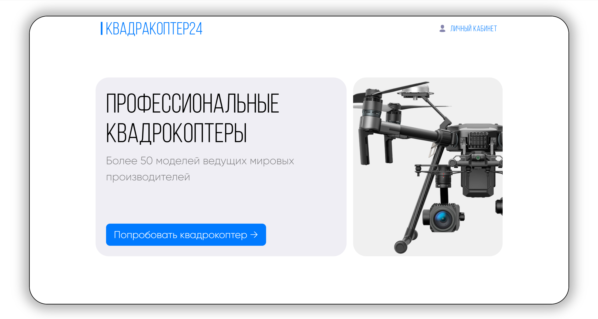

# Quadracopter24



## Documentation

- [Description](#description)
- [Start App](#start-app)
- [Tech Stack](#tech-stack)
- [Competitors](#competitors)
- [License](#license)


## Description

The service was created as part of the 24-hour Digital Sky Innovations hackathon and is designed to collect user requests for the use of a quadcopter. The client fills out a form in which he describes for what purposes he needs a drone. Based on the entered text, the neural network classifies the type of a suitable quadcopter and automatically generates an application for analysts. Analysts, having received the pre-classified information, select the appropriate model and arrange for the drone to be sent to the client.

## Start App

To run the application, you need to have a Node virtual environment.js and also download and run Docker. After that, repeat the steps described below in the listing. 

```bash
1. git clone https://github.com/DKMFzF/fkv_test.git

2. Run
the chmod +x script that raises the application. start-app.sh
./start-app.sh

3. Go through the route http://localhost:8081

```

## Tech Stack

- **Frontend и локальный frontend Backend (fkv-service-client)**
  - React
  - Redux
  - Axios
  - Express
  - TypeScript
  - Scss
  - Webpack

- **Backend API Python сервис (fkv-service)**
  - Python
  - FastAPI
  - Pydantic
  - SQLAlchemy
  - Bcrypt

- **Backend Node.js сервис (fkv-notification-service)**
  - JavaScript
  - Express
  - Nodemailer

- **ML сервис обработки данных (fkv-service-ml)**
  - Fastapi
  - Numpy
  - Pandas
  - Scikit-learn
  - Torch, Torchvision
  - Gensim
  - Nltk
  - Jupyter

## Competitors

- [Vladislav](https://github.com/vladikhub )
- [DKMFzF](https://github.com/DKMFzF )
- [Fedor](https://github.com/cocolo13 )

## License
MIT
